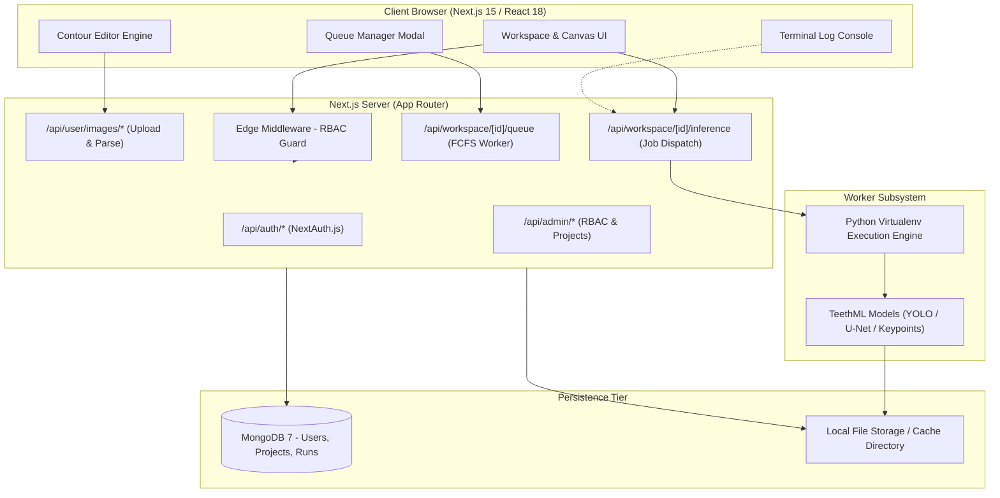

<div align="center">

# TeethML — Web Platform (`TeethML-UI`)

**Clinical Dental Radiograph AI Inference, Interactive Multi-Layer Contour Editor & Annotation Workspace**

[](https://nextjs.org/)
[](https://react.dev/)
[](https://www.typescriptlang.org/)
[](https://tailwindcss.com/)
[](https://www.mongodb.com/)
[](https://next-auth.js.org/)
[](https://www.docker.com/)
[](LICENSE)

*An end-to-end, enterprise-ready clinical workstation for panoramic and bitewing dental radiographs (OPGs), integrating deep-learning segmentation models, precision polygon contour editing, dynamic UI controls, and asynchronous job queuing.*

</div>

---

## 📌 Table of Contents

- [Overview](#-overview)
- [Key Features](#-key-features)
  - [1. Dynamic Workspace & Multi-Layer Overlay](#1-dynamic-workspace--multi-layer-overlay)
  - [2. Precision CAD-Style Contour & Vertex Editor](#2-precision-cad-style-contour--vertex-editor)
  - [3. Deep Learning Subprocess Engine & Queue Manager](#3-deep-learning-subprocess-engine--queue-manager)
  - [4. Smart File Explorer & Annotation Synchronizer](#4-smart-file-explorer--annotation-synchronizer)
  - [5. Project Administration & In-Browser Python Editor](#5-project-administration--in-browser-python-editor)
  - [6. Enterprise RBAC & Security Audit Logs](#6-enterprise-rbac--security-audit-logs)
- [System Architecture](#-system-architecture)
- [Tech Stack](#-tech-stack)
- [Project Directory Structure](#-project-directory-structure)
- [Quick Start Guide](#-quick-start-guide)
  - [Prerequisites](#prerequisites)
  - [Docker Development Stack](#option-a-docker-development-stack-recommended)
  - [Docker Production Deployment](#option-b-docker-production-deployment)
  - [Local Bare-Metal Setup](#option-c-local-bare-metal-setup)
- [Environment Variables](#-environment-variables)
- [Inference Pipeline Integration](#-inference-pipeline-integration)
- [License](#-license)

---

## 🔬 Overview

**TeethML Web Platform (`TeethML-UI`)** brings deep-learning dental diagnostics into a responsive, secure web environment. Built with **Next.js 15 App Router**, **MongoDB**, and **Tailwind CSS**, it serves as the central clinical workstation for dental clinicians, radiologists, and AI researchers.

Clinicians can upload high-resolution panoramic radiographs (OPGs), trigger multi-stage Python ML inference pipelines (teeth segmentation, jawline boundaries, anatomical keypoint detection), inspect color-coded vector contours, and fine-tune polygon annotations using interactive CAD tools in real time.

---

## ✨ Key Features

### 1. Dynamic Workspace & Multi-Layer Overlay
- **Virtual Scaled Canvas (`WorkspaceContourViewer`)**: High-performance SVG vector rendering pipeline overlaying high-resolution radiographs.
- **Granular Anatomical Layers**:
  - 🦷 **Individual Tooth Polygons**: FDI Two-Digit World Dental Federation notation (11–48).
  - 🦴 **Jawline Boundaries**: Mandible and Maxilla contour curves.
  - 📍 **Anatomical Keypoints**: Left/Right Cementoenamel Junctions (`lcej`, `rcej`), Root Apices (`lrap`, `rrap`), and Alveolar Bone Crests (`abl`, `abr`).
- **Dynamic Control Elements**: Customizable UI widgets including arguments switches, group switches, type filters, and dynamic layout buttons.

### 2. Precision CAD-Style Contour & Vertex Editor
- **Dedicated Editor Mode (`/workspace/[projectId]/edit/[runId]`)**: Dedicated editing viewport with pan, zoom (25% to 800%), and reset controls.
- **Vertex-Level Polygon Editing**: Click-and-drag individual vertices, add points along boundary edges, and right-click to prune erroneous nodes.
- **Layer Visibility & Opacity Management**: Real-time slider controls for layer opacity and visibility toggling.
- **Direct LabelMe JSON Serialization**: In-browser serialization into industry-standard LabelMe JSON formats.

### 3. Deep Learning Subprocess Engine & Queue Manager
- **FCFS Job Queue**: First-Come, First-Served asynchronous worker queue preventing GPU/CPU starvation on intensive inference runs.
- **Real-Time Queue Telemetry**: Live position tracking (`Position #1`, `Running (N)`, `Queue (N)`) with one-click job cancellation.
- **Asynchronous Execution & Polling**: Runs Python virtualenv models as isolated OS child processes with automated stdout/stderr polling via Server-Sent Events / hooks.
- **Live Terminal Console (`WorkspaceConsole` / `LogConsole`)**: Monospaced real-time build and execution stream logs.

### 4. Smart File Explorer & Annotation Synchronizer
- **Dual Pairing Workflow**: Automatically pairs uploaded radiographs (`.png`, `.jpg`, `.bmp`) with existing `.json` annotation files.
- **Status Indicators**: Visual badges indicate whether an image has paired JSON contours or requires an inference run.
- **Multi-Format Export Engine**:
  - 📦 **Standard ZIP**: Image files bundled alongside matching LabelMe JSON files.
  - 📄 **Self-Contained JSON**: Embedded Base64 `imageData` directly inside the JSON annotation.

### 5. Project Administration & In-Browser Python Editor
- **Virtual Environment Management**: Automated Python `venv` initialization, dependency installation, and health checks.
- **Built-in Code Editor (`ScriptEditor`)**: In-browser code editor with syntax highlighting, line numbers, and keyboard shortcuts (`Ctrl+S`) to modify inference scripts on the fly.
- **Live Model Testing**: Execute scripts directly within the project's isolated virtualenv and inspect stdout/stderr drawers.

### 6. Enterprise RBAC & Security Audit Logs
- **3-Tier Role-Based Access Control**:
  - `super_admin`: Full tenant management, audit logs, project allocation, and user CRUD.
  - `project_admin`: Model scripting, environment build, and team project management.
  - `user`: Image uploads, inference execution, and contour annotation editing.
- **Audit Logs (`/admin/audit`)**: Security event tracking, user login history with IP logging, and historical inference run audit trails.

---

## 🏗️ System Architecture



---

## 💻 Tech Stack

| Layer | Technology | Purpose |
|:---|:---|:---|
| **Frontend Framework** | [Next.js 15 (App Router)](https://nextjs.org/) | Server Components, routing, SSR & API routes |
| **UI Library** | [React 18](https://react.dev/) | Client-side reactive interface & canvas rendering |
| **Language** | [TypeScript 5](https://www.typescriptlang.org/) | End-to-end type safety |
| **Styling** | [Tailwind CSS 3.4](https://tailwindcss.com/) | Dark-mode design system (`surface-*`, `brand-*`) |
| **Icons** | [Lucide React](https://lucide.dev/) | Modern UI icon library |
| **Database** | [MongoDB 7](https://www.mongodb.com/) | Document persistence for users, projects, and runs |
| **Authentication** | [NextAuth.js v4](https://next-auth.js.org/) | Google OAuth, Magic Links & Credentials RBAC |
| **Archive Utilities** | [JSZip](https://stuk.github.io/jszip/) | Client-side batch annotation packaging |
| **Containerization** | [Docker & Compose](https://www.docker.com/) | Multi-stage containerized deployments |

---

## 📁 Project Directory Structure

```text
TeethML-UI/
├── docker/
│   └── mongo-init.js              # Initial MongoDB database setup
├── public/                        # Static brand assets and favicons
├── scripts/
│   ├── create-super-admin.mjs     # CLI seed script for Super Admin creation
│   └── setup-db.mjs               # MongoDB index creation & seed data
├── src/
│   ├── app/                       # Next.js 15 App Router
│   │   ├── admin/                 # Admin console (Projects, Users, Audit)
│   │   │   ├── audit/page.tsx     # Security and inference audit logs
│   │   │   ├── projects/page.tsx  # Project builder, file tree, venv manager
│   │   │   ├── users/page.tsx     # User management & project assignment
│   │   │   └── layout.tsx         # Admin sidebar navigation shell
│   │   ├── api/                   # Serverless API routes
│   │   │   ├── admin/             # Project, script, and user endpoints
│   │   │   ├── auth/              # NextAuth.js handlers & password change
│   │   │   ├── user/              # Image uploads, JSON handlers, history
│   │   │   └── workspace/         # Inference triggering, queue, annotations
│   │   ├── auth/                  # Authentication views (Login, Verify)
│   │   ├── settings/              # User preferences & profile settings
│   │   ├── workspace/[projectId]/ # Interactive clinical workspace
│   │   │   ├── edit/[runId]/      # Vector contour & keypoint editor
│   │   │   ├── layout.tsx         # Workspace layout container
│   │   │   └── page.tsx           # Scaled canvas, image gallery, toolbars
│   │   ├── layout.tsx             # Root application shell
│   │   └── page.tsx               # Presentation landing page
│   ├── components/                # Reusable React components
│   │   ├── admin/                 # Build logs, script editors, project panels
│   │   ├── auth/                  # Login & authentication forms
│   │   ├── landing/               # Hero, features, navigation, footer
│   │   ├── layout/                # SiteHeader, DashboardSidebar, SiteFooter
│   │   ├── ui/                    # Modals, toasts, buttons, form inputs
│   │   └── workspace/             # Contour viewers, file pickers, consoles
│   ├── hooks/                     # Custom React hooks (inference, venv logs)
│   ├── lib/                       # MongoDB client, NextAuth configs, RBAC guards
│   ├── middleware.ts              # Route protection & role enforcement
│   └── types/                     # Shared TypeScript interfaces
├── .env.example                   # Environment configuration template
├── docker-compose.prod.yml        # Production Docker Compose orchestration
├── docker-compose.yml             # Development Docker Compose configuration
├── Dockerfile                     # Multi-stage production container build
├── Dockerfile.dev                 # Hot-reloading development container
├── package.json                   # Project dependencies and script definitions
├── tailwind.config.ts             # Tailwind design tokens & dark theme
└── tsconfig.json                  # TypeScript configuration
```

---

## 🚀 Quick Start Guide

### Prerequisites
- [Node.js](https://nodejs.org/) (v18.0.0 or higher) & `npm`
- [Docker](https://www.docker.com/) & Docker Compose (Recommended)
- [MongoDB](https://www.mongodb.com/) (v6.0 or higher if running locally)
- [Python 3.10+](https://www.python.org/) with `venv` (for ML execution)

---

### Option A: Docker Development Stack (Recommended)

1. **Clone the repository:**
   ```bash
   git clone https://github.com/LoNE-W0LvES/TeethML-UI-src.git
   cd TeethML-UI-src
   ```

2. **Configure environment:**
   ```bash
   cp .env.example .env
   ```
   *(Update Google OAuth, MongoDB, or SMTP variables as needed).*

3. **Start the complete stack:**
   ```bash
   docker compose up -d
   ```
   This automatically launches:
   - **Next.js Web Server**: `http://localhost:3090` (or configured port)
   - **MongoDB Engine**: `localhost:27017`
   - **Mailhog Test Mailbox**: `http://localhost:8025`

4. **Initialize database & create admin:**
   ```bash
   docker compose exec app node scripts/setup-db.mjs
   docker compose exec app node scripts/create-super-admin.mjs
   ```

---

### Option B: Docker Production Deployment

1. **Configure production secrets:**
   ```bash
   cp .env.prod.example .env.prod
   # Generate secure random secret: openssl rand -base64 32
   ```

2. **Launch optimized multi-stage build:**
   ```bash
   docker compose -f docker-compose.prod.yml --env-file .env.prod up -d --build
   ```

---

### Option C: Local Bare-Metal Setup

1. **Install dependencies:**
   ```bash
   npm install
   ```

2. **Provision database:**
   ```bash
   npm run setup-db
   npm run create-admin
   ```

3. **Run development server:**
   ```bash
   npm run dev
   ```

Open [http://localhost:3090](http://localhost:3090) to view the workstation.

---

## ⚙️ Environment Variables

| Variable | Description | Default / Example |
|:---|:---|:---|
| `MONGODB_URI` | MongoDB connection connection string | `mongodb://localhost:27017/mlui` |
| `NEXTAUTH_URL` | Canonical URL of the application | `http://localhost:3090` |
| `NEXTAUTH_SECRET` | Cryptographic secret for signing session JWTs | `openssl rand -base64 32` |
| `GOOGLE_CLIENT_ID` | Google OAuth Client ID (optional) | `your-id.apps.googleusercontent.com` |
| `GOOGLE_CLIENT_SECRET` | Google OAuth Secret (optional) | `GOCSPX-your-secret` |
| `EMAIL_SERVER_HOST` | SMTP server host for magic link emails | `localhost` |
| `EMAIL_SERVER_PORT` | SMTP port | `1025` (Mailhog) / `587` |
| `EMAIL_FROM` | Sender address for transactional emails | `noreply@teethml.local` |

---

## 🔄 Inference Pipeline Integration

The web application connects seamlessly to the core Python inference backend ([Teeth-ML](https://github.com/LoNE-W0LvES/Teeth-ML)):
1. **Model Staging**: When an inference run is initiated, radiographs are dispatched to the project's sandboxed filesystem.
2. **Subprocess Execution**: The backend invokes the project virtual environment runner:
   ```bash
   python main.py users/[userId]/json users/[userId]/run_[runId]/payload.json '[extraArgs]' users/[userId]/run_[runId]
   ```
3. **Structured Output**: Resulting LabelMe-compliant JSON shape coordinates are parsed, validated, and rendered onto the canvas.

---

## 📄 License

This project is licensed under the [MIT License](LICENSE) — authored by [LoNE WoLvES](https://github.com/LoNE-W0LvES).
